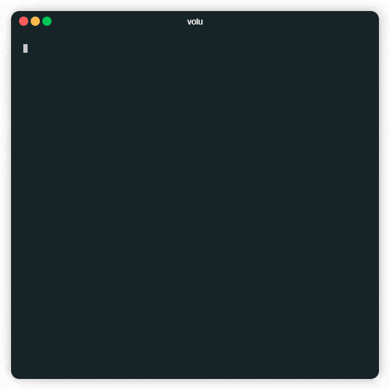
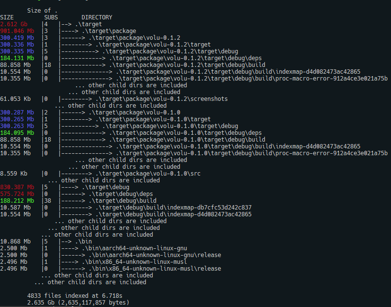
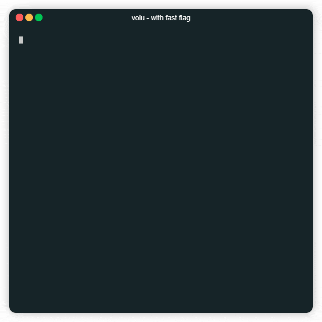

# Volu: directories usages and file size

[](https://crates.io/crates/volu)
[](https://crates.io/crates/volu)

Prints the size of the given directory or file, featuring the largest dirs
and a full map of each dir's child-directories



## Features:

- Pretty Light-weight (8Kb of source code and 2.2Mb of binaries)

- Prints the usage of directory and its child-directories 

- Map of the usage of all directories and their children

- Sorts the child-directories by usage

- Highlight the largest directory in each directory
  
  

## Install

Using Cargo: `cargo install volu`

Using Github: download the latest binaries in the github release

## Usage

### Feature Update: `--fast`

Need faster performance? Is progress pointless to you?
Use `--fast` flag to tell volu not to waste time on printing the progress

<div style="display: flex; flex-direction: row">
  
  
</div>

Current dir's usage: `volu`  
Usage of a specific dir: `volu path/to/dir/`  
Print a list of all *parent dirs*: `volu -p`  
Print a sorted parent dirs list: `volu -s`  
Limit the number of printed parent dirs list: `volu -l 11`  
Print a sized map of all dirs and their children: `volu -m`  
Print a limited sized map of dirs and only ten children of itself: `volu -m --child-limit 10`  

Most complete results: `volu -ma path/to/dir/`
Most minimal results: `volu path/to/dir/`
Most efficient results: `volu -f path/to/dir/` 

```command
volu 0.2.1
Arian Mirahmadi (thearian@github) (mirarianmir@gmail.com)
Prints the size of the given directory, featuring the largest dirs

USAGE:
    volu.exe [OPTIONS] [DIR]

ARGS:
    <DIR>    The parent directory [default: .]

OPTIONS:
    -a, --all                          Print all the parent directories, no limit
        --child-limit <CHILD_LIMIT>    Print and limit the count of children directories [default:
                                       9999]
    -f, --fast                         Doesnt show progress which causes better performance
    -h, --help                         Print help information
    -l, --limit <LIMIT>                Sort and limit the count of parent directories [default: 25]
    -m, --map                          Print child of parent directories
    -p, --print                        Print the parent directories
    -s, --sort                         Sort the parent directories
    -V, --version                      Print version information
```
